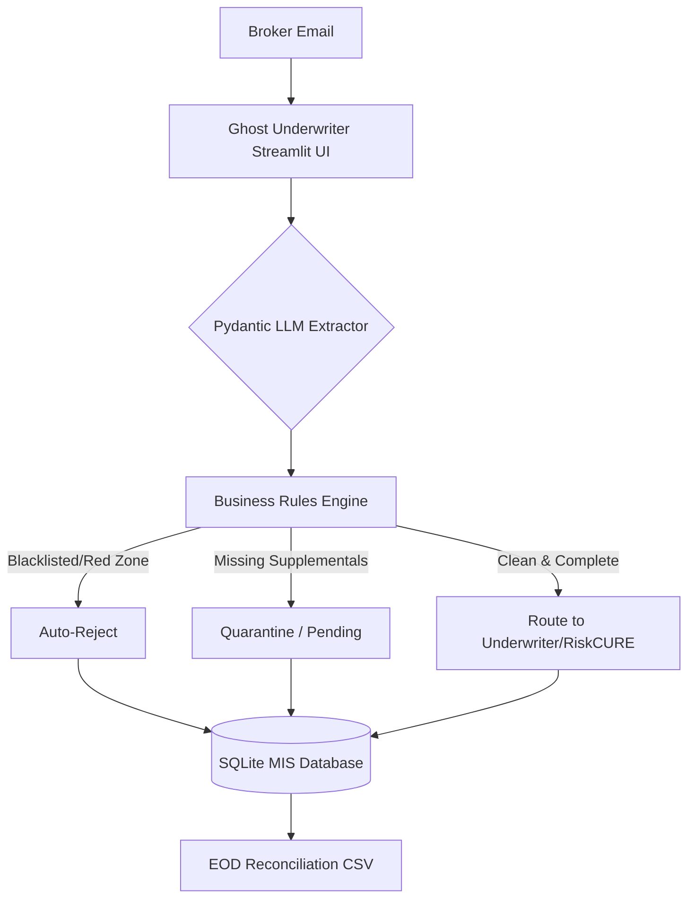

# Ghost Underwriter: Enterprise Triage Automation

An open-source workflow automation engine designed to solve the "pre-parsing" bottleneck in commercial insurance underwriting.

## ⚠️ The Problem
AI solutions like RiskCURE are exceptional at extracting structured data from unstructured ACORD forms and emails. However, **before an underwriter even uses AI**, they waste up to 40% of their day manually triaging emails to determine if the risk even fits their appetite.

If a broker submits a policy for a blacklisted geography, or forgets to attach mandatory loss runs, running that submission through expensive LLM extraction is a waste of compute and time.

## 🛠️ The Solution (Ghost Underwriter)
Ghost Underwriter sits *in front* of the AI extraction engine. It acts as an automated Chief of Staff for the underwriter's inbox. 

It intercepts incoming broker emails, simulates an LLM to extract key metadata, runs the data through strict enterprise business rules, and routes the output automatically.

### Key Features
1. **Pydantic LLM Mocking:** Simulates structured, validated JSON output from unstructured email text.
2. **Enterprise Triage Rules:** 
   - Cross-references broker names against a Do Not Do Business (Blacklist) database.
   - Quarantines high-risk industry submissions (e.g., Construction) if mandatory supplemental applications are missing.
   - Auto-declines properties located in restricted/red pincode zones.
3. **Legacy MIS Integration:** Automatically logs every decision into an SQLite database (simulating a legacy Tier-1 carrier backend) and generates a daily End-of-Day (EOD) Reconciliation CSV for Operations Managers.
4. **Interactive Streamlit UI:** A clean, dual-tab interface to test the triage engine and view live MIS logs.

## 🏗️ Architecture



## 🚀 How to Run Locally

1. **Clone the repository:**
   ```bash
   git clone https://github.com/abluvsu/pibit-ghost-ops.git
   cd pibit-ghost-ops
   ```

2. **Install requirements:**
   ```bash
   pip install -r requirements.txt
   ```

3. **Launch the Web App:**
   ```bash
   streamlit run src/app.py
   ```
