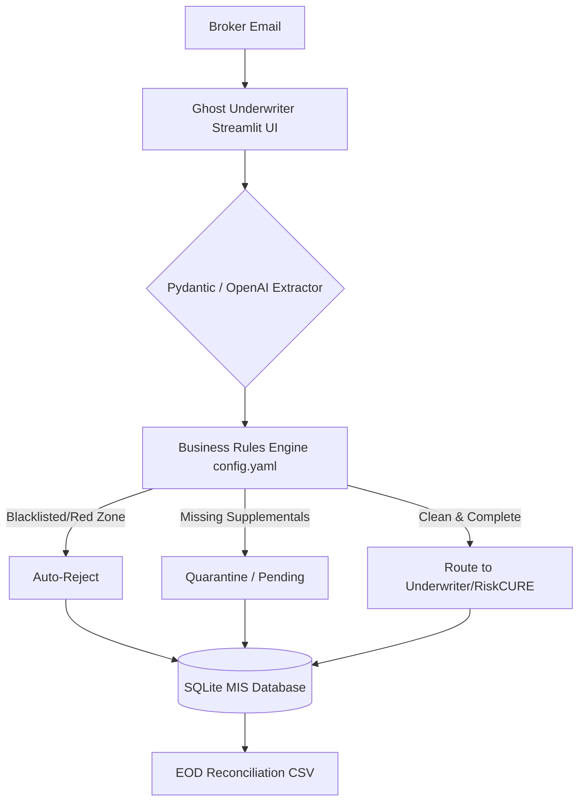

# Ghost Underwriter: Enterprise Triage Automation (v4)

[](https://github.com/abluvsu/pibit-ghost-ops/actions/workflows/test.yml)
[](https://www.python.org/downloads/release/python-3110/)
[](https://www.docker.com/)

An open-source, production-grade workflow automation engine designed to solve the "pre-parsing" bottleneck in commercial insurance underwriting.

## ⚠️ The Problem
AI solutions like RiskCURE are exceptional at extracting structured data from unstructured ACORD forms and emails. However, **before an underwriter even uses AI**, they waste up to 40% of their day manually triaging emails to determine if the risk even fits their appetite.

If a broker submits a policy for a blacklisted geography, or forgets to attach mandatory loss runs, running that submission through expensive LLM extraction is a waste of compute and time.

## 🛠️ The Solution (Ghost Underwriter)
Ghost Underwriter sits *in front* of the AI extraction engine. It acts as an automated Chief of Staff for the underwriter's inbox. 

### Enterprise Architecture Features
1. **Real OpenAI LLM Integration (with Fallbacks):** Uses OpenAI to extract structured JSON via Pydantic schemas. If no API key is provided, the system gracefully falls back to a deterministic Mock extractor. No crashes.
2. **YAML Configuration:** All business logic (Blacklisted Brokers, Red Pincodes, Max Claims) is extracted into `config.yaml` to separate code from business configuration.
3. **CI/CD & Pytest:** Protected by a rigid `pytest` suite testing edge cases, automated via GitHub Actions on every push.
4. **Containerization:** Fully containerized. Run the entire stack locally with `docker-compose up`.
5. **Observability:** Robust rotating logs written to `logs/ghost_ops.log` via the Python `logging` module.

## 🏗️ Architecture



## 🚀 How to Run (Docker)
The easiest way to run the UI and Database is via Docker.
```bash
git clone https://github.com/abluvsu/pibit-ghost-ops.git
cd pibit-ghost-ops
docker-compose up --build
```
Navigate to `http://localhost:8501`.

## 💻 How to Run (Local Python)
1. **Install dependencies:**
   ```bash
   pip install -r requirements.txt
   ```
2. **Configure Environment:**
   Rename `.env.example` to `.env` and add your OpenAI API key (optional).
3. **Launch the Web App:**
   ```bash
   streamlit run src/app.py
   ```
4. **Run Pytest Suite:**
   ```bash
   pytest tests/
   ```
